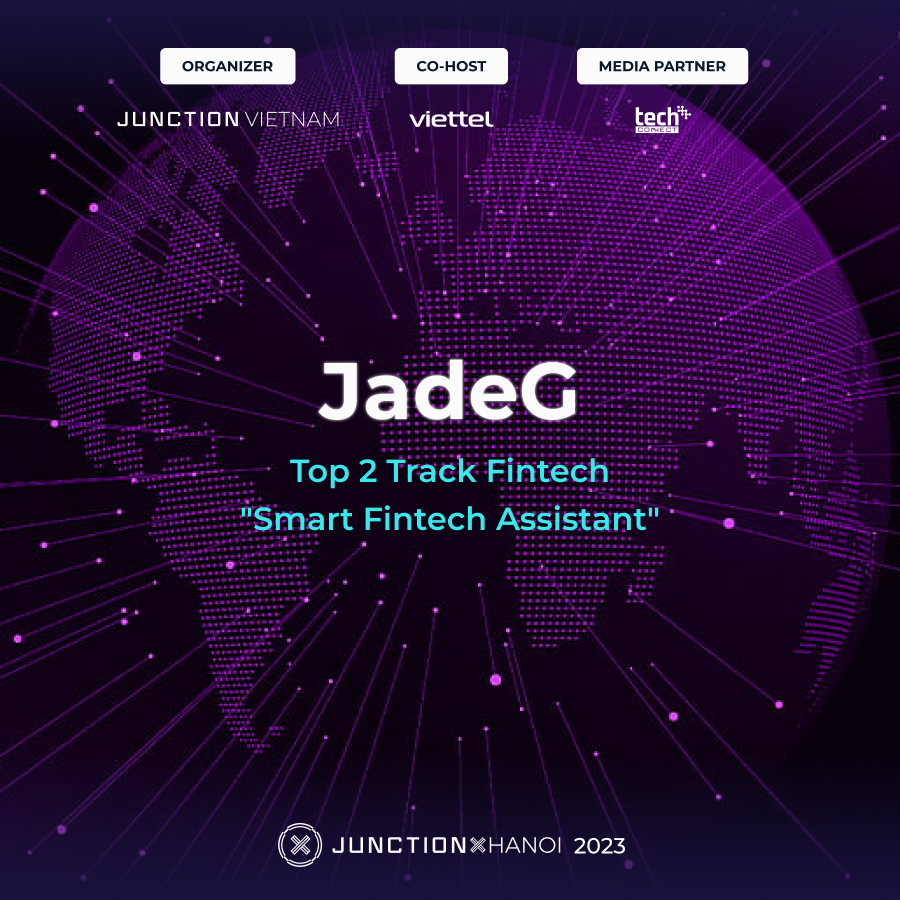
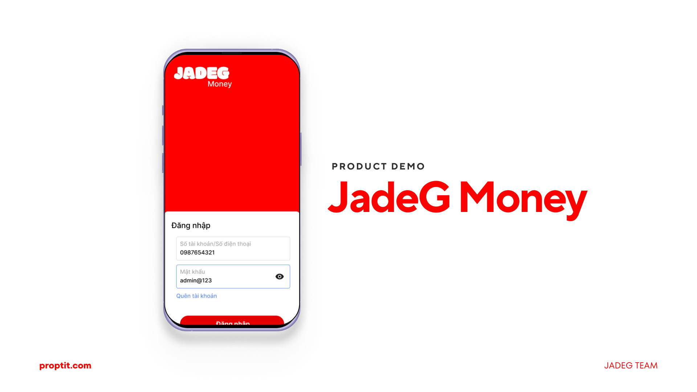
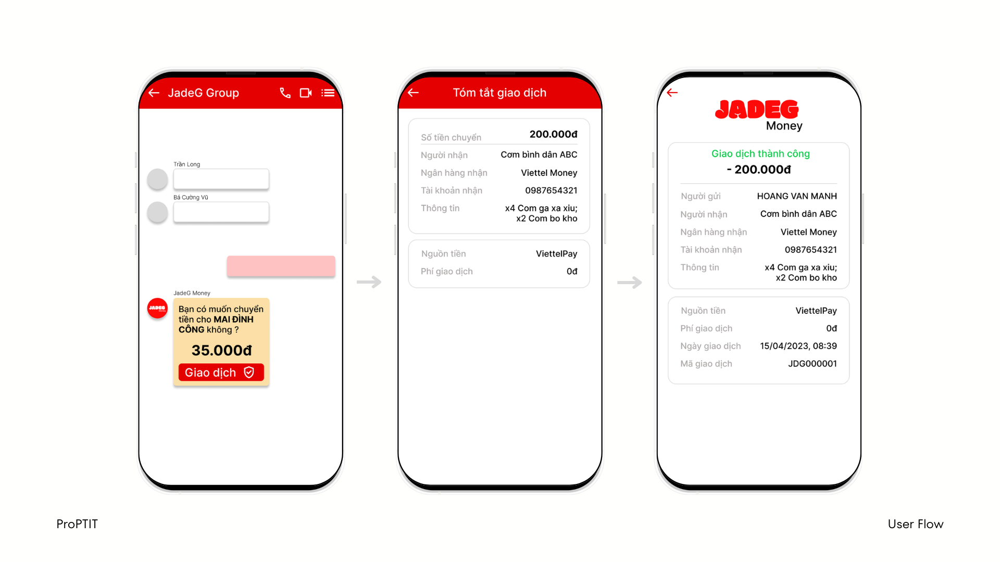

# JadeG Money

## Author

* JadeG Team 
- Dam Minh Anh
- Dinh Hoang Anh
- Nguyen Quoc Hung
- Nguyen Nam Hai
- Nguyen Thi Ngoc Thuy

## Description

Introducing JadeG Money, a Fintech project that aims to revolutionize the way people transfer money within groups. This application enables quick, convenient, and easy money transfers between individuals through the use of an AI-powered virtual assistant built using a classification tree model and prepared data. Developed in just two days for the Junction X Hackthon Hanoi 2023 competition, JadeG Money received the 1st Runner Up award for the Fintech technology track



### Prerequisites

* To run this software, you need an editor with java support, java - version 11 or higher,android-studio
* Install java 11 using the commands:
`sudo apt update`
`sudo apt install openjdk-11-jre-headless`
* Install android-studio
`sudo snap install android-studio --classic`


### Setup

* Clone the project
* Open in android-studio


## Technologies Used

* Java (version 11)
* Android 
* Gradle (7.1)
* A.I Decision Tree
* Firebase Cloud Messaging, Firebase Realtime,...
* Location Services


## Demo image




## License Information

* This software is licensed under MIT License.
* [Read More](https://choosealicense.com/licenses/mit/) on the license.


```
MIT License

Copyright (c) 2023 JadeG Team

Permission is hereby granted, free of charge, to any person obtaining a copy
of this software and associated documentation files (the "Software"), to deal
in the Software without restriction, including without limitation the rights
to use, copy, modify, merge, publish, distribute, sublicense, and/or sell
copies of the Software, and to permit persons to whom the Software is
furnished to do so, subject to the following conditions:

The above copyright notice and this permission notice shall be included in all
copies or substantial portions of the Software.

THE SOFTWARE IS PROVIDED "AS IS", WITHOUT WARRANTY OF ANY KIND, EXPRESS OR
IMPLIED, INCLUDING BUT NOT LIMITED TO THE WARRANTIES OF MERCHANTABILITY,
FITNESS FOR A PARTICULAR PURPOSE AND NONINFRINGEMENT. IN NO EVENT SHALL THE
AUTHORS OR COPYRIGHT HOLDERS BE LIABLE FOR ANY CLAIM, DAMAGES OR OTHER
LIABILITY, WHETHER IN AN ACTION OF CONTRACT, TORT OR OTHERWISE, ARISING FROM,
OUT OF OR IN CONNECTION WITH THE SOFTWARE OR THE USE OR OTHER DEALINGS IN THE
SOFTWARE.
```
